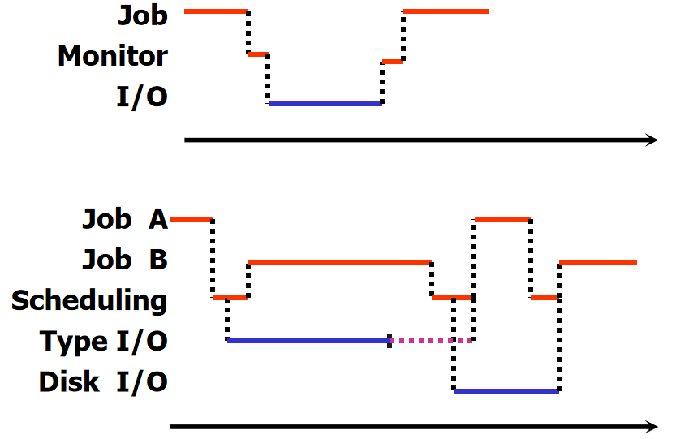
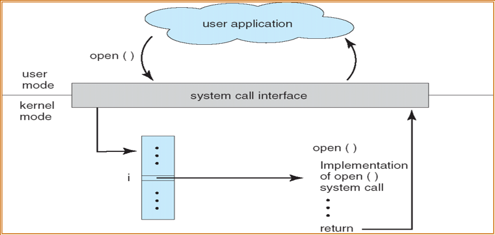

# 操作系统

## 1.导论

### 1.1概念

用于管理和控制系统资源，合理组织计算机工作流程，方便用户使用计算机的程序集。

### 1.2计算机系统组织

现代通用计算机系统有一个或多个CPU和若干设备控制器通过共同的总线相连而成，该总线提供了对主存的访问。
每一个类型的设备有各自的控制器。

### 1.3计算机系统操作

- I/O设备和CPU同时执行
- 每个设备控制器负责一个特定的设备类型
- 每个设备控制器都有一个本地缓冲区
- CPU将数据从主存移动到本地缓冲区
- I/O是从设备到控制器的本地缓冲区
- 设备控制器通过中断通知CPU它已经完成了它的操作

中断源：能够产生中断的资源。
中断：CPU暂停当前处理程序，转去执行中断处理程序的过程。
中断处理过程：1.保存现场；2.转去执行中断处理程序；3.恢复现场。
中断向量：包含所有中断处理程序的地址。
> 中断分为硬件和软件中断，硬件可随时通过系统总线向CPU发出信号，已触发中断。软件通过执行特别的操作如系统调用，触发中断。

### 1.4I/O结构

I/O开始后，控制返回程序的方式：

1. 同步：在I/O完成时。
2. 异步：不等待I/O完成。

直接内存访问(direct memory access)

- 用于能够以接近内存速度传输信息的高速I/O设备
- 设备控制器直接将数据块从缓冲存储器传输到主存储器，不需要CPU的干预
- 每个块只产生一个中断，而不是每个字节产生一个中断

### 1.5多道程序设计

操作系统同时将多个任务保存在内存中。
作业调度(高级调度)：按照一定算法，从外存中选择满足的作业入内存(宏观)。
CPU调度(低级调度)：按照一定算法，从内存选择满足条件的作业分配CPU。

作业状态


单道程序设计与多道程序设计作业对比


优点：

1. 提高CPU利用率
2. 提高内存和I/O设备利用率
3. 提高系统吞吐量

特点：

1. 多道
2. 无序
3. 调度

### 1.6实时系统

严格的时间要求
硬实时：数据存在内存或ROM(只读存储器)
软实时
中断处理机制更强

### 1.7双重模式操作

双模式操作允许操作系统保护自己和其他系统组件。

1. 用户模式和内核模式
2. 模式位由硬件提供
    - 区分系统何时运行用户代码或内核代码
    - 一些被指定为特权的指令
    - 系统调用将模式更改为内核，从调用中返回并将其重置为用户

## 2.操作系统结构

### 2.1操作系统服务

用户界面

1. 命令界面(commond-line interface, CLI)
2. 图形化界面(graphical user interface, GUI)
3. 批界面(Batch)

程序执行
I/O操作
文件系统操作
通信
错误检测
资源分配
统计
保护和安全

- 保护：确保对系统资源的所有访问都受到控制
- 安全：保护I/O设备不受非法访问

### 2.2系统调用

**系统调用**：操作系统提供的编程接口，主要通过高级应用程序接口(API)访问，而不是直接使用系统调用。
系统调用实现：

> 每个系统调用都有一个相关联的数字
> 查找系统调用表来定位预期的函数
> 调用预期的函数并返回状态和值

向操作系统传参的方法：

1. 通过寄存器传参
2. 将参数存在内存中的块和表中，并将块和表的地址放入寄存器来传递
3. 通过堆栈

### 2.3操作系统的设计和实现

通过定义系统的目标和规范来实现。在最高层，受硬件选择、系统类型选择的影响。
需求可分为两个基本类：用户目标和系统目标。

1. 用户目标：使用方便、容易学习、可靠、安全、快捷
2. 系统目标：易于设计、实现和维护，灵活、可靠、无错误、高效

策略:做什么
机制:如何做

### 2.4操作系统结构

简单结构
分层结构
微内核
模块化
虚拟机

## 3.进程

### 3.1进程概念

进程：一个有独立功能的程序，关于某个数据集合的一次运行过程。
进程包括：程序计数器、寄存器、堆栈段、数据段、文本段还有堆。
进程状态：

> 新的(new)：进程正在被创建
> 就绪(ready)：进程等待分配处理器
> 运行(running)：指令正在被运行
> 等待(waiting)：等待某个事件的发生(如I/O完成或收到信号)
> 终止(terminated)：进程完成执行

进程与程序的区别：

1. 动态与静态
2. 生命周期
3. 进程 = 程序 + 数据 + PCB
4. 一个程序可以对应多个进程
5. 一个进程可以包含多个程序
6. 没有进程的程序不能被运行(进程是被CPU调度的基本单位)

程序控制块(process control block, PCB)：有结构的主存区，用于保存进程所有的相关信息；随着对应进程的创建而创建，对应进程的消亡而撤销。(系统通过PCB里的相关信息感知进程，**PCB是进程存在的唯一标志**)

PCB存储的信息：

1. 进程状态
2. 程序计数器
3. CPU寄存器
4. CPU调度信息
5. 内存管理信息
6. 记账信息
7. I/O状态信息

### 3.2进程调度

进程调度队列：

1. 作业队列：系统中的所有进程集合
2. 就绪队列：驻留在内存中就绪的、等待被运行的进程的集合
3. 设备队列：等待I/O设备的进程的集合

> 进程在各种队列中迁移

| 长期调度                       | 短期调度                        |
| ------------------------------ | ------------------------------- |
| 选择应该将哪些进程放入就绪队列 | 选择接下来执行哪个进程并分配CPU |
| 从外存到内存                   | 从就绪队列中                    |
| 频率较低                       | 更频繁                          |
中期调度：核心思想是能将进程从内存(或从CPU竞争)总移出， 从而降低多道程序设计的程度。之后，进程能被重新调入内存，并从中断处继续执行。这种方案成为交换。
绝大多数进程可分为：I/O型进程(I/O-bound)、CPU型进程(CPU-bound)

上下文切换(Context Switch)：当进程切换到另一个进程时，需要保存当前进程状态并另一个进程的状态。上下文切换的时间是开销，时间依赖于硬件支持。

### 3.3进程操作

进程创建：

- 父进程创建子进程，每个新进程可以在创建其他进程，从而形成了进程树。
- 三种资源共享方式
    1. 父进程和子进程共享所有资源
    2. 子进程共享父进程资源的一部分
    3. 父、子进程不共享资源
- 执行
    1. 父、子进程并发执行
    2. 父进程等待子进程执行完
- 地址空间
    1. 子进程是父进程的副本
    2. 子进程装入另外一个新程序

进程终止：当进程完成执行最后的语句并使用系统调用exit()请求操作系统删除自身时，进程终止。这时进程可以返回状态值到父进程(用过系统调用wait())。进程资源有操作系统重新分配。
父进程可以终止子进程(abort)。父进程终止子进程的原因有很多，如：

- 子节点已经超出了已分配的资源
- 不再需要分配给子进程的任务
- 父结点退出，父进程终止，那么操作系统不允许子进程在父进程终止时继续(级联终止)

### 3.4进程间通信

独立进程：一个进程不能影响其他进程或不被其他进程影响，那么该进程是独立的。
协同进程：一个进程能能影响其他进程或被其他进程影响，那么该进程是协同的。
协同进程的优点：

- 信息共享
- 提高运算速度
- 模块化
- 方便

进程间通信机制(interprocess communication, IPC)，进程间通信两大类：信息传递(message passing)、共享内存(share memory)

生产者-消费者问题
条件：由生产者和消费者共享的缓冲区，生产者产生信息，消费者消费

| 无限缓冲                                             | 有限缓冲                                               |
| ---------------------------------------------------- | ------------------------------------------------------ |
| 消费者可能不得不等待新的项，但生产者总是可以产生新项 | 缓冲为空时，消费者必须等待；缓冲为满时，生产者必须等待 |

> 有限缓冲下
> 生产者进程
>
> ```c
> while(true) {
>   /*produce an item in nextProduced*/
>   while(((in+1)%BUFFER_SIZE) == out);
>   buffer[in] = nextProduced;
>   in = (in+1)%BUFFER_SIZE;
> }
> ```
>
> 消费者进程
>
> ```c
> while(true) {
>   while(in == out);
>   nextCosumed = buffer[out];
>   out = (out+1)%BUFFER_SIZE;
>   /*consumed the item in nextConsumed*/
> }
> ```
>
> 这样的解决方式存在缺陷

信息传递提供一种机制以允许进程不必通过共享地址空间来实现通信和同步。
信息传递提供两种操作：

1. send()
    固定大小：系统及实现简单，编程任务困难。
    可变长大小：更复杂的系统级实现，但编程任务变得简单。
2. receive()

如果进程P和Q需要通信，那么他们必须彼此相互发送消息和接受消息，他们之间必须要有通信线路。下面是一些逻辑实现通信线路和send()/receive()操作的方法。

1. 直接通信
   - 属性
     - 线路是自动建立的
     - 一个链接仅与一对正在通信的进程相关联
     - 每一对之间存在一个线路
     - 线路可能是单向的，但通常是双向的
   - 原语操作定义
     - send(P, message)：发送消息到P进程
     - receive(Q, messafg)：接受来自进程Q的消息
2. 间接通信
   - 属性
     - 仅当进程共享邮箱时才建立通信线路
     - 一个链接可以与许多进程相关联
     - 两个进程可以有多个不同的线路，每个线路对应一个邮箱
     - 线路可以使单向的，也可以是双向的
   - 操作
     - 创建新邮箱
     - 通过邮箱发送和接受消息
     - 删除邮箱
   - 原语操作定义
     - send(A, message)：发送消息到邮箱A
     - receive(A, messafg)：接受来自邮箱A的消息
3. 同步与异步
   - 阻塞send：发送进程阻塞，知道消息被接受进程或邮箱所接收
   - 非阻塞send：发送进程发送消息并再继续操作
   - 阻塞receive：接受者阻塞，直到有消息可用
   - 非阻塞receive：接受者收到一个有效消息或空消息
4. 缓冲
   - 零容量
   - 有限容量
   - 无限容量

## 4.线程

## 5.CPU调度

## 6.进程同步

## 7.死锁

## 8.内存管理(实存)

## 9.虚存管理

## 10.文件系统

## 11.大容量存储器

## 12.I/O输入系统