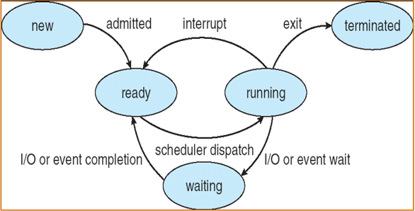

# 操作系统

## 1.导论

### 1.1概念

用于管理和控制系统资源，合理组织计算机工作流程，方便用户使用计算机的程序集。

### 1.2计算机系统组织

现代通用计算机系统有一个或多个CPU和若干设备控制器通过共同的总线相连而成，该总线提供了对主存的访问。
每一个类型的设备有各自的控制器。

### 1.3计算机系统操作

- I/O设备和CPU同时执行
- 每个设备控制器负责一个特定的设备类型
- 每个设备控制器都有一个本地缓冲区
- CPU将数据从主存移动到本地缓冲区
- I/O是从设备到控制器的本地缓冲区
- 设备控制器通过中断通知CPU它已经完成了它的操作

中断源：能够产生中断的资源。
中断：CPU暂停当前处理程序，转去执行中断处理程序的过程。
中断处理过程：1.保存现场；2.转去执行中断处理程序；3.恢复现场。
中断向量：包含所有中断处理程序的地址。
> 中断分为硬件和软件中断，硬件可随时通过系统总线向CPU发出信号，已触发中断。软件通过执行特别的操作如系统调用，触发中断。

### 1.4I/O结构

I/O开始后，控制返回程序的方式：

1. 同步：在I/O完成时。
2. 异步：不等待I/O完成。

直接内存访问(direct memory access)

- 用于能够以接近内存速度传输信息的高速I/O设备
- 设备控制器直接将数据块从缓冲存储器传输到主存储器，不需要CPU的干预
- 每个块只产生一个中断，而不是每个字节产生一个中断

### 1.5多道程序设计

操作系统同时将多个任务保存在内存中。
作业调度(高级调度)：按照一定算法，从外存中选择满足的作业入内存(宏观)。
CPU调度(低级调度)：按照一定算法，从内存选择满足条件的作业分配CPU。

作业状态


单道程序设计与多道程序设计作业对比


优点：

1. 提高CPU利用率
2. 提高内存和I/O设备利用率
3. 提高系统吞吐量

特点：

1. 多道
2. 无序
3. 调度

### 1.6实时系统

严格的时间要求
硬实时：数据存在内存或ROM(只读存储器)
软实时
中断处理机制更强

### 1.7双重模式操作

双模式操作允许操作系统保护自己和其他系统组件。

1. 用户模式和内核模式
2. 模式位由硬件提供
    - 区分系统何时运行用户代码或内核代码
    - 一些被指定为特权的指令
    - 系统调用将模式更改为内核，从调用中返回并将其重置为用户

## 2.操作系统结构

### 2.1操作系统服务

用户界面

1. 命令界面(commond-line interface, CLI)
2. 图形化界面(graphical user interface, GUI)
3. 批界面(Batch)

程序执行
I/O操作
文件系统操作
通信
错误检测
资源分配
统计
保护和安全

- 保护：确保对系统资源的所有访问都受到控制
- 安全：保护I/O设备不受非法访问

### 2.2系统调用

**系统调用**：操作系统提供的编程接口，主要通过高级应用程序接口(API)访问，而不是直接使用系统调用。
系统调用实现：

> 每个系统调用都有一个相关联的数字
> 查找系统调用表来定位预期的函数
> 调用预期的函数并返回状态和值

向操作系统传参的方法：

1. 通过寄存器传参
2. 将参数存在内存中的块和表中，并将块和表的地址放入寄存器来传递
3. 通过堆栈

### 2.3操作系统的设计和实现

通过定义系统的目标和规范来实现。在最高层，受硬件选择、系统类型选择的影响。
需求可分为两个基本类：用户目标和系统目标。

1. 用户目标：使用方便、容易学习、可靠、安全、快捷
2. 系统目标：易于设计、实现和维护，灵活、可靠、无错误、高效

策略:做什么
机制:如何做

### 2.4操作系统结构

简单结构
分层结构
微内核
模块化
虚拟机

## 3.进程

### 3.1进程概念

进程：一个有独立功能的程序，关于某个数据集合的一次运行过程。
进程包括：程序计数器、寄存器、堆栈段、数据段、文本段还有堆。
进程状态：

> 新的(new)：进程正在被创建
> 就绪(ready)：进程等待分配处理器
> 运行(running)：指令正在被运行
> 等待(waiting)：等待某个事件的发生(如I/O完成或收到信号)
> 终止(terminated)：进程完成执行

进程与程序的区别：

1. 动态与静态
2. 生命周期
3. 进程 = 程序 + 数据 + PCB
4. 一个程序可以对应多个进程
5. 一个进程可以包含多个程序
6. 没有进程的程序不能被运行(进程是被CPU调度的基本单位)

程序控制块(process control block, PCB)：有结构的主存区，用于保存进程所有的相关信息；随着对应进程的创建而创建，对应进程的消亡而撤销。(系统通过PCB里的相关信息感知进程，**PCB是进程存在的唯一标志**)

PCB存储的信息：

1. 进程状态
2. 程序计数器
3. CPU寄存器
4. CPU调度信息
5. 内存管理信息
6. 记账信息
7. I/O状态信息

### 3.2进程调度

进程调度队列：

1. 作业队列：系统中的所有进程集合
2. 就绪队列：驻留在内存中就绪的、等待被运行的进程的集合
3. 设备队列：等待I/O设备的进程的集合

> 进程在各种队列中迁移

| 长期调度                       | 短期调度                        |
| ------------------------------ | ------------------------------- |
| 选择应该将哪些进程放入就绪队列 | 选择接下来执行哪个进程并分配CPU |
| 从外存到内存                   | 从就绪队列中                    |
| 频率较低                       | 更频繁                          |
中期调度：核心思想是能将进程从内存(或从CPU竞争)总移出， 从而降低多道程序设计的程度。之后，进程能被重新调入内存，并从中断处继续执行。这种方案成为交换。
绝大多数进程可分为：I/O型进程(I/O-bound)、CPU型进程(CPU-bound)

上下文切换(Context Switch)：当进程切换到另一个进程时，需要保存当前进程状态并另一个进程的状态。上下文切换的时间是开销，时间依赖于硬件支持。

### 3.3进程操作

进程创建：

- 父进程创建子进程，每个新进程可以在创建其他进程，从而形成了进程树。
- 三种资源共享方式
    1. 父进程和子进程共享所有资源
    2. 子进程共享父进程资源的一部分
    3. 父、子进程不共享资源
- 执行
    1. 父、子进程并发执行
    2. 父进程等待子进程执行完
- 地址空间
    1. 子进程是父进程的副本
    2. 子进程装入另外一个新程序

进程终止：当进程完成执行最后的语句并使用系统调用exit()请求操作系统删除自身时，进程终止。这时进程可以返回状态值到父进程(用过系统调用wait())。进程资源有操作系统重新分配。
父进程可以终止子进程(abort)。父进程终止子进程的原因有很多，如：

- 子节点已经超出了已分配的资源
- 不再需要分配给子进程的任务
- 父结点退出，父进程终止，那么操作系统不允许子进程在父进程终止时继续(级联终止)

### 3.4进程间通信

独立进程：一个进程不能影响其他进程或不被其他进程影响，那么该进程是独立的。
协同进程：一个进程能能影响其他进程或被其他进程影响，那么该进程是协同的。
协同进程的优点：

- 信息共享
- 提高运算速度
- 模块化
- 方便

进程间通信机制(interprocess communication, IPC)，进程间通信两大类：信息传递(message passing)、共享内存(share memory)

生产者-消费者问题
条件：由生产者和消费者共享的缓冲区，生产者产生信息，消费者消费

| 无限缓冲                                             | 有限缓冲                                               |
| ---------------------------------------------------- | ------------------------------------------------------ |
| 消费者可能不得不等待新的项，但生产者总是可以产生新项 | 缓冲为空时，消费者必须等待；缓冲为满时，生产者必须等待 |

> 有限缓冲下
> 生产者进程
>
> ```c
> while(true) {
>   /*produce an item in nextProduced*/
>   while(((in+1)%BUFFER_SIZE) == out);
>   buffer[in] = nextProduced;
>   in = (in+1)%BUFFER_SIZE;
> }
> ```
>
> 消费者进程
>
> ```c
> while(true) {
>   while(in == out);
>   nextCosumed = buffer[out];
>   out = (out+1)%BUFFER_SIZE;
>   /*consumed the item in nextConsumed*/
> }
> ```
>
> 这样的解决方式存在缺陷

信息传递提供一种机制以允许进程不必通过共享地址空间来实现通信和同步。
信息传递提供两种操作：

1. send()
    固定大小：系统及实现简单，编程任务困难。
    可变长大小：更复杂的系统级实现，但编程任务变得简单。
2. receive()

如果进程P和Q需要通信，那么他们必须彼此相互发送消息和接受消息，他们之间必须要有通信线路。下面是一些逻辑实现通信线路和send()/receive()操作的方法。

1. 直接通信
   - 属性
     - 线路是自动建立的
     - 一个链接仅与一对正在通信的进程相关联
     - 每一对之间存在一个线路
     - 线路可能是单向的，但通常是双向的
   - 原语操作定义
     - send(P, message)：发送消息到P进程
     - receive(Q, messafg)：接受来自进程Q的消息
2. 间接通信
   - 属性
     - 仅当进程共享邮箱时才建立通信线路
     - 一个链接可以与许多进程相关联
     - 两个进程可以有多个不同的线路，每个线路对应一个邮箱
     - 线路可以使单向的，也可以是双向的
   - 操作
     - 创建新邮箱
     - 通过邮箱发送和接受消息
     - 删除邮箱
   - 原语操作定义
     - send(A, message)：发送消息到邮箱A
     - receive(A, messafg)：接受来自邮箱A的消息
3. 同步与异步
   - 阻塞send：发送进程阻塞，知道消息被接受进程或邮箱所接收
   - 非阻塞send：发送进程发送消息并再继续操作
   - 阻塞receive：接受者阻塞，直到有消息可用
   - 非阻塞receive：接受者收到一个有效消息或空消息
4. 缓冲
   - 零容量
   - 有限容量
   - 无限容量

## 4.线程

线程是可以被独立调度的基本单位，它有线程ID、程序计数器、寄存器集合和栈组成，与属于同一进程的其他线程共享代码段、数据段和其他操作系统资源。
特点：灵活、系统消耗低，可用于多处理机。

多线程模型：

1. 多对一模型：将许多用户级线程映射到一个内核级线程，任一时刻只能有一个线程访问内核，故不能用于多处理。
2. 一对一模型：将每个用户线程映射到一个内核线程，可用于多处理器，但是每创建一个用户线程就需要创建一个相应的内核线程，所以需要限制数量。
3. 多对多模型：可用于多处理器。

## 5.CPU调度

**CPU调度时机**：

1. 进程从running到waiting
2. 时间片到了(从running到ready)
3. 就绪队列来进程，会引起一次新调度
4. 进程终止

> 1,4主动(非抢占的)；2,3(被动)抢占的

调度器(分派程序)功能：上下文切换、切换到用户态和跳转。

**调度准则**：

- CPU使用率
- 吞吐量：单位时间内完成进程的数量
- 周转时间：从进程提交到进程完成的时间段称为周转时间
- 等待时间：在就绪队列中等待所花费的时间
- 响应时间：从提交请求到第一响应的时间

> 需要使CPU使用率和吞吐量最大化，而使周转时间、等待时间和响应时间最小化。

**调度算法**：
先到先服务调度(FCFS)
  优点：公平；缺点：平均等待时间长

最短作业优先调度(SJF)
  思想：当CPU空闲时，会赋给最短CPU区间的进程
  困难：如何知道下一个CPU区间的长度
  解决办法：使用指数平均法
  变化：抢占SJF调度(最短剩余时间调度)

优先级调度
  分类：抢占和非抢占
  问题：饥饿

轮转法调度(RR)
  思想：定义一个较小时间单元，称为时间片，将就绪队列作为循环队列。CPU调度程序循环就绪队列
  特点：响应时间短，周转时间长
  影响因素：时间片，终端数
> 时间片趋近无穷时就是FCFS

多级队列调度
  思想：将就绪队列分成多个独立队列。
  举例：一个常用的划分方法是前台(交互)进程和后台(批处理)进程，每个队列都有一定的CPU时间。例如，前台可以有80%的CPU时间进行RR调度，后台队列可以有20%的CPU时间进行FCFS调度

多级反馈队列调度
  思想：
    1.分成多个优先级，有不同优先级
    2.所有进程入最高级队列
    3.最先调度高优先级队列
    4.当前被调度进程在时间内完成则出队，未完成就降级
    5.当高优先级队列为空，转下一级队列调度
> 多级反馈队列调度是一个综合型调度算法，包含了前面5中调度算法。

## 6.进程同步

互斥使用共享变量或数据结构
**临界资源(Critical Resource)**：一次只能被一个进程使用，例如，慢速设备、共享变量和数据结构

使用临界资源的代码结构：
进入区(Entry section)、**临界区(Critical section)**、结束区(Exit section)、剩余区(Remainder section)

临界使用准则：
1.空闲让进
2.忙则等待
3.让权等待
4.有限等待

软件解决方案——Peterson算法

```cpp
//pi
while(true) {
    flag[i] = true;
    turn = j;
    while(flag[j] && turn == j);
    //CRITICAL SECTION
    flag[i] = false;
    //REMAINDER SECTION
}
//没有解决忙等问题
```

硬件解决方案
1.TS(Test And Set)

```cpp
bool TestAndSet(bool *target) {
    bool rv = *target;
    *target = true;
    return rv;
}

do{
    while(TestAndSet(&lock));
    //CRITICAL SECTION
    lock = false;
    //REMAINDER SECTION
}while(true);
```

2.Swap

```cpp
void Swap(bool *a, bool *b) {
    bool temp = *a;
    *a = *b;
    *b = temp;
}

do{
    key = true;
    while(key == true)
      Swap(&lock, &key);
    //CRITICAL SECTION
    lock = false;
    //REMAINDER SECTION
}while(true);
```

> 同样存在忙等问题

**信号量**(Semaphore)
  定义：只能通过P、V操作(原语操作)修改其值的整形变量，成为信号量。
  类型：
    1.互斥信号量(初值为1)，也称为互斥锁。
    2.计数信号量(一般信号量)
    3.记录型信号量机制：
      信号量S在P、V操作中的物理意义：
      P(S)向系统申请S代表的临界资源，V(S)释放一个S代表的临界资源

```cpp
P(semaphore *S) {
    S->value--;
    if(S->value < 0) {
        //add this process to S->list;
        block();
    }
}

V(semaphore *S) {
    S->value--;
    if(S->value <= 0) {
        //remove a process P from S->list;
        wakeup(P);
    }
}

// |S->value|是等待进程数
```

经典同步问题

- 生产者-消费者问题
- 读者-写者问题
- 哲学家进餐问题

## 7.死锁

死锁：两个或两个以上由于竞争资源导致进程互为等待而无法推进，此时系统状态称为死锁。
死锁产生原因(2)：资源相对不足、推进顺序不合理
死锁产生的必要条件(4)：互斥、占有并等待、非抢占、循环等待
死锁处理方法(3)：不允许出现、可恢复、假定不会出现

**死锁预防**
思想：破换四个必要条件之一
1.破坏占有并等待：一次性资源分配法(缺：浪费、系统道数降低)
2.破坏循环等待：有序资源使用法，给资源进行编号，按编号进行申请(缺：浪费，但比一次性资源分配法好)

**死锁避免**
银行家算法
思想：当用户申请一组资源时，系统必须确定这些资源的分配是否仍会使系统处于安全状态，如果是，就可分配资源；否则，进程必须等待直到某个其他进程释放足够资源为止。
前提：多实例、每个进程预先声明需要多少资源。
数据结构：
Available：资源向量(长度为m的向量，m为资源种类数)
Max：定义进程的最大需求(n * m矩阵，n表示进程数)
Allocation：定义每个进程已分配的资源(n * m矩阵，n表示进程数)
Need：定义每个进程还需要的资源数(n * m矩阵，n表示进程数)
> 注意：Need[i][j] = Max[i][j] - Allocation[i][j]

安全性算法：
1.设Work和Finish分别为长度为m和n的向量，Work=Available且对于i=0,1,...,n-1，Finish[i]=false。
2.查找这样的i满足Finish[i]=false且Need[i]<=Work[i]，若没有则跳转到第4步。
3.Work[i]+=Allocation[i];Finish[i]=true;返回第二步。
4.如果对于所有的i，Finish[i]=true，那么系统处于安全状态。
> 这个算法需要n * m^2数量级的操作确定系统状态是否安全

资源请求算法：
1.设Request[i]为Pi的请求向量，如果Request[i][j]=k，那么进程Pi需要资源类型Rj的实例数量为k。
2.如果Request[i]<=Need[i]，那么转到第3步。否则产生错误条件，因为进程Pi超过最大请求。
3.如果Request[i]<=Available，那么转到第4步；否则Pi必须等待，因为没有可用的资源。
4.假定系统可以分配给进程Pi所请求的资源，并按以下方式修改状态：
Available = Available - Request[i];
Allocation[i] = Allocation[i] + Request[i];
Need[i] = Need[i] - Request[i];
如果产生的资源分配状态是安全的这分配；否则进程Pi等待并恢复到原来资源分配状态。

**死锁检测**
等待图(单实例)
检测算法(多实例，类似银行家算法)

**死锁恢复**
终止：
1.终止全部
2.一次终止一个知道死锁解除
> 如何决定终止哪一个进程?

## 8.内存管理(实存)

逻辑地址：用户程序中的地址称为逻辑地址，也称为相对地址。
逻辑地址空间：有程序所生成的所有逻辑地址的集合。
物理地址：绝对地址。
物理地址空间：与逻辑地址相对应的所有物理地址的集合。
逻辑地址到物理地址的转换称为程序的重定位。
静态重定位：运行前完成转换(优：执行效率高，缺：不能移动)
动态重定位：运行前不重定位，运行中完成，需要使用基址寄存器、界限寄存器(优：可移动，缺：执行效率下降)

### 8.1连续内存分配(作业进入主存时分配连续)

1.固定分区分配(分区数量固定，分区大小固定)
缺：道数低、浪费(内碎片)
2.可变分区分配(分区数量可变，分区大小可变)
分配：从未分配表中找足够大的内存区域分配
分配策略：首次适应、最佳适应、最差适应。
> 首次适应：未分配表按起始地址排序，找到第一个足够大的内存区域
> 最佳适应：未分配表按内存区域从小到大排序，找到第一个足够大的内存区域
> 最差适应：未分配表按内存区域从大到小排序，找到第一个足够大的内存区域

分区回收：判断相邻分区是否分配，如没有则合并两个分区。
碎片：总空间满足，但是不连续，称为碎片。
> 解决办法：程序浮动/存储紧缩，或允许物理地址空间不连续

### 8.2分页存储管理

思想：
1.物理地址按2^n等分成页框(架/帧)，从0开始编号
2.逻辑地址按页框大小等分成页，从0开始编号
3.逻辑地址表示(p, d)，p表示页号，d表示页内偏移
4.连续页可分配不连续页框(离散分配)
5.每个作业一张页表，保存作业各个页入内存情况
6.系统设置两个寄存器保存当前运行进程的页表的起始地址和长度
> 虚地址 -> 实地址
> 1.直接地址映像：查页表(缺：效率50%)
> 2.相关地址映像：配置8到16个超高速寄存器用于暂存当前运行进程的页表表目。查找时先查寄存器，若找到，直接得到地址；否则，查表并将表目放入寄存器
>
> 页框的分配和回收通过空页框链表。

超高速寄存器的置换策略要符合程序局部性特征。
> 程序局部性特征
> 1.时间局部性：刚被访问的主存单元不久后还会被访问。
> 2.空间局部性：刚被访问的主存单元其邻近单元不久后会被访问。

页表表目扩充：页号、页框号、保护位、有效位。
页面共享：如果页面为纯页(可重入/只读)，则可以共享。
页表结构：层次页表、哈希页表、反置页表。

### 8.3分段存储管理

思想：

## 9.虚存管理

## 10.文件系统

## 11.大容量存储器

## 12.I/O输入系统
