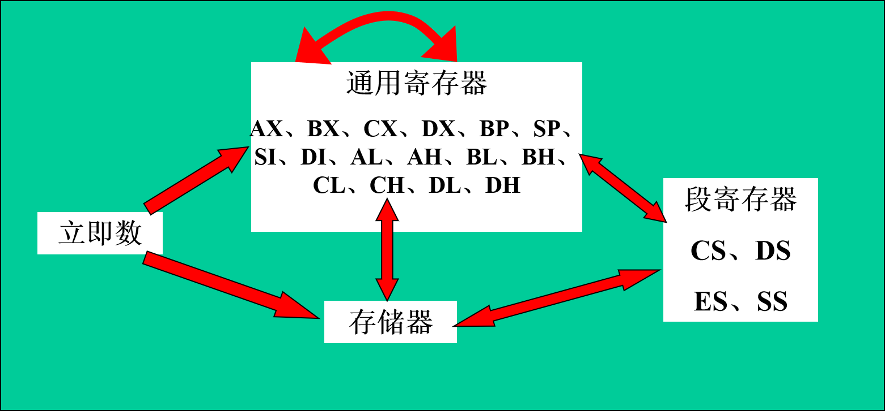

# Assembly Language

- [Assembly Language](#assembly-language)
  - [基础知识](#%e5%9f%ba%e7%a1%80%e7%9f%a5%e8%af%86)
  - [寄存器](#%e5%af%84%e5%ad%98%e5%99%a8)
  - [伪指令](#%e4%bc%aa%e6%8c%87%e4%bb%a4)
  - [程序](#%e7%a8%8b%e5%ba%8f)

## 基础知识

1. 机器语言
   1. 机器指令：是一系例由二进制数（0或1）组成的代码构成的，机器唯一能正确执行的命令。
   2. 机器语言：机器指令的集合。
   3. **机器语言特点**：难记忆、可读性差、不易修改，直接面向机器，所以不同的微处理器可有不同的机器语言。但编写的程序占用内存小，运行速度快，能直接对硬件控制。
2. 汇编语言
   1. 汇编语言是机器语言便于记忆的书写格式，特点：兼有机器语言的有点，比机器语言易记易学，但是通用性差，随机而异。
   2. 汇编：用汇编程序将源程序翻译成机器代码的过程。
3. 存储器
   * 存储器(内存)是计算机中仅次于CPU的核心部件，**由它向CPU提供要运行和处理的数据。**（注：CPU不能直接和磁盘交换数据，必须由内存来交换。）
4. 指令和数据
   1. 指令：告诉计算机做什么工作。
   2. 数据：计算机(CPU)要处理的对象。
   * **注意**：指令和数据在形式上完全相同，都是一组二进制信息，但在应用上意义不同。
5. 储存单元
   * 将存储器划分成若干个基本的存储单位，称为存储单元。给每个存储单元从0开始顺序编号，称为**存储单元的地址**。
     1. 位(bit)：计算机的最小信息单位，即移位二进制数(1或1)
     2. 字节(Byte)：1Byte = 8bit
6. CPU对存储器的读写
   1. 读：CPU可以从存储器中取出数据进行处理。 写：CPU将处理后的数据放到存储器中保存。
   2. CPU传送的三种信息：地址信息（存储单元的地址）、控制信息（选择芯片、读或写的命令）、数据信息（读或写内存的数据内容）。
7. 三总线结构
   1. 地址总线的宽度决定了CPU的寻址能力，一个CPU有N根地址线，则可说这个CPU的地址总线宽度为N。可寻址空间为2N个存储单元。
   2. 数据总线的宽度决定了CPU和外界的数据传送速度，N根数据线一次可以传送N个bit的数据。
   3. CPU对外部器件的控制是通过控制总线进行的，控制总线是一些不同控制线的集合。有多少根控制总线，就意味着，这个CPU提供了对外部器件的多少种控制，所以**控制总线的宽度决定了CPU对外部器件的控制能力。**

## 寄存器

1. 寄存器组
   1. 通用寄存器：AX、BX、CX、DX，每个通用寄存器可分为两个独立的8位寄存器使用。如：AX可分为AL和AH。
   2. 指针寄存器：SP(堆栈指针)、BP(基数指针)
   3. 变址寄存器：SI(源变址)、DI(目的变址)
   4. 控制寄存器：IP(指令指针)、PSW(状态标志)
        |  标志位符号  |                                                说明                                                |
        | :----------: | :------------------------------------------------------------------------------------------------: |
        |  ZF零标志位  |                         指示出算术或比较运算的结果(1=结果为0，0=结果不为0)                         |
        | PF奇偶标志位 |                         指示运算结果中低8位的1奇/偶数校验(1=偶数，0=奇数)                          |
        | SF符号标志位 |                               为算术运算结果的正负号(1=负号，0=正号)                               |
        | CF进位标志位 | 在算术运算后最高位(最左)所产生的进位(1=有进位，0=无进位)，以及移位或循环移位运算时所移出的位的状态 |
        | OF溢出标志位 |                                 表示在有符号算术运算时是否发生溢出                                 |
        | DF方向标志位 |                      在比较或搬移字符串数据时，指示其地址操作方向为增值或减值                      |
        * AF辅助进位标志位、TF陷阱标志位、IF中断标志位
   5. 段寄存器：CS(代码段)、DS(数据段)、SS(堆栈段)、ES(附加段)
   6. 8086CPU的内部寄存器都是16位。
2. **当通用寄存器作为8位寄存器使用时，低8位和高8位相当于两个独立的寄存器，它们之间没有直接关系，不能产生进位。**
3. 物理地址 = 段地址×16+偏移地址 = 段地址（左移4位）+偏移地址
4. 段
   1. 段是我们为了管理内存而引入的一个虚拟的概念，我们可以将内存地址连续、起始地址为16的倍数的一组内存单元看作一个段来管理，但事实上，内存并没有被真正划分成段。
   2. 一个物理地址可能对应多个逻辑地址。
5. CS和IP
   1. CS提供当前要执行的指令的段地址，IP指向当前要执行的指令的偏移地址。
   2. 修改CS、IP指令为jmp，不可以直接给CS和IP赋值。

       ```asm
       jmp 段地址:偏移地址 ;同时修改CS、IP的内容
       ;只修改IP内容
       jmp 偏移地址
       jmp 某一合法寄存器
       ```

6. **字单元**：即存放一个字型数据（16位）的内存单元，由两个地址连续的内存单元组成。高地址内存单元中存放字型数据的高位字节，低地址内存单元中存放字型数据的低位字节。
7. 寄存器、立即数、存储之间的访问
   
8. 数据的存取：当向内存单元中存取数据时，若操作的为字节型数据则一次读写一个内存单元，若为字型数据则按低地址为低8位，高地址为高8位的原则存取数据。

## 伪指令

1. ASSUME：段分配，用于说明程序中定义的段有哪个寄存器去寻址。
   * 注意：使用ASSUME伪指令进行段分配后，CPU并不能自动将段寄存器指向该段。程序刚加载到内存时，CS可根据END 标号来指向程序入口地址，而DS和ES的值为PSP的段地址；SS为DS+10H。所以在源程序中我们要通过指令初始化DS，ES和SS的值。
2. START：程序的开始。
3. END：程序的结束。
4. SEGMENT和ENDS：定义段，一个完整的汇编程序一般包括代码段、数据段、堆栈段，其中代码段必须有。
5. 标号代表某一存储单元的地址，可以使用字母、数字、特殊字符(? . @ _ $)，数字不能用于开头，点只能用于开头，标号最长31个字符。
6. dup：和db、dw、dd等数据定义伪指令配合使用，用来进行数据的重复。
   * 格式：DB n dup (重复的数据)
7. offset：取得一个标号的偏移地址。

## 程序

1. DEBUG中可以使用`MOV AX,[idata]`, 但是在汇编程序中只能使用`MOV AX,[BX]`。
2. 定义数据伪指令：DB——字节型数据、DW——字型数据、DD——双字数据。
   * 格式：DB 数据1,数据2,...
3. 更灵活的内存定位方法：

   ```asm
   [bX]
   [si]
   [bi]
   [bx+idata]
   [bx+si]
   [bx+di]
   [bx+si+idata]
   [bx+di+idata]
   ```

4. 8086CPU中只能使用bx、si、di、bp这4个寄存器寻址内存单元。
   1. 在[]中这4个寄存可以单独出现，或只能以下列组合出现：bx和si、di；bp和si、di；
   2. 只要在[]中出现bp这段地址默认为ss。
5. 指令处理的数据长度
   1. 8086CPU可以处理的数据长度：字节(8位)和字(16位)；
   2. 汇编语言中的处理方法：
      1. 通过寄存器指明要处理的数据长度；
      2. 在没有寄存器的情况下使用word ptr/byte ptr指明数据长度；
      3. 默认长度。
6. div除法指令：div op(内存单元，寄存器)
   1. 被除数：16位放在ax；32位低16位挡在ax，高16位放在dx；
   2. 除数：8位或16位，放在op中；
   3. 结果：8位除数，商放在AL中，余数放在AH中；16位除数，商放在AX中，余数放在DX中；
   4. 注意：被除数长度必须是除数长度两倍。
7. 转移指令
   1. 无条件转移指令jmp
      1. jmp short 标号(段内直接短转移)：ip = ip + 8位偏移量；
      2. jmp near ptr 标号(段内直接近转移)：ip = ip + 16位偏移量；
      3. jmp word ptr opr/jmp 寄存器(段内间接转移)：ip = (opr)/ip = 寄存器
      4. jmp far ptr 标号(段间直接转移)：ip = 标号所在偏移地址，CS = 标号所在段地址；
      5. jmp dword ptr [] (段间间接转移)：用内存单元中的双字的低字修改ip，高字修改CS的值。
   2. 条件转移指令jcxz
      * jcxz 标号：当CX=0时转移到标号处执行(所有的条件转移都是段内短转移)
   3. 循环指令loop(所有的循环指令都是段内短转移)
8. 返回指令与call指令
   1. ret实现短转移，相当于pop ip；
   2. retf实现远转移，相当于pop ip pop cs;
   3. call指令功能相当于：1.push ip或push cs push ip; 2.修改当前ip或ip和cs指向目的地址。
      1. 根据位移转移：call 标号
      2. 转移的目的地址转在指令中：call far ptr 标号
      3. 转移地址在寄存器中：call 寄存器
      4. 转移地址在内存中：call word(dword) ptr []
   4. call和ret配合使用可以实现子程序调用
9. mul乘法指令
   1. 格式：mul reg或mul []；
   2. 8位乘法中，一个乘数默认在AL中，另一个由指令给出，16位的结果默认保存在AX中；
   3. 16位乘法中，一个乘数默认在AX中，另一个由指令给出，32位的结果中高位保存在DX中，低位在AX中。
10. 带进位加法指令adc和带错位减法指令sbb
    1. adc op1, op2：op1+op2+CF -> op1
    2. sbb op1, op2：op1-op2-CF -> op1
11. cmp比较指令
    1. cmp op1, op2：比较OP1，OP2的大小（OP1-OP2），只影响标志位，不影响OP1和OP2的内容。
    2. OP1可为寄存器和内存单元；OP2可为立即数、通用寄存器或内存单元。常用于条件转移指令的条件判断。
    3. cmp指令判断条件：
       1. op1=op2时，zf=1
       2. 操作数为无符号数时：不会溢出of=0。若cf=0则op1 > op2；若cf=1则op1 < op2
       3. 操作数为有符号数时：
          1. 符号相同不会溢出of=0。若sf=0则op1 > op2；若sf=1则op1 < op2
          2. 符号不同时有可能溢出。of=sf时op1 > op2；否则op1 < op2
    4. 检测比较结果的条件转移指令
          |  指令   |     含义     | 检测的相关标志位 |
          | :-----: | :----------: | :--------------: |
          |  JE(=)  |  等于则转移  |       ZF=1       |
          | JNE(!=) | 不等于则转移 |       ZF=0       |
          |  JB(<)  |  低于则转移  |       CF=1       |
          | JNB(>=) | 不低于则转移 |       CF=0       |
          |  JA(>)  |  高于则转移  |    CF=0且ZF=0    |
          | JNA(<=) | 不高于则转移 |    CF=1或ZF=1    |
12. 串传送指令(movsb movsw)与重复执行指令(rep)
    1. movsb按字节传送
    2. movsw按字传送
    3. 格式：rep movsb(movsw)
    4. **注意**：ds:si指向源地址，es:di指向目的地址；(cld指令将DF置为0)DF=0时si=si+1, di=di+1; (std指令将DF置为1)DF=1时si=si-1, di=di-1; 重复执行直到CX为0。
13. pushf和popf
    1. pushf将标志寄存器的值压栈
    2. popf总栈中弹出数据送入标志寄存器中
