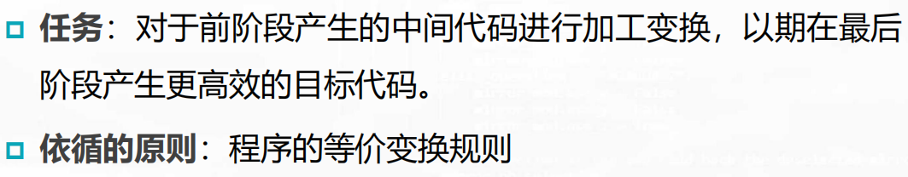

# 编译原理

## 第一章 引论

### 翻译程序

### 编译程序

**分类**:

### 解释程序

### 编译过程

**词法分析**:

**语法分析**:

**中间代码产生**:

**优化**:

**目标代码生成**:

### 编译程序逻辑结构

### 表格与表格管理

### 出错处理

### 遍（Pass)

### 编译前端和后端

### 参数传递

### 存储管理

## 第二章 高级语言及其语法描述

### 程序语言定义

> 文法：描述语言的语法结构的形式规则（即语法规则）。
>
> 上下文无关文法组成：一组终结符、一组非终结符、一个开始符号、一组产生式。

### 文法形式化定义和分类

**形式化定义**：

**分类**：

> 左线性文法：A->Ba或A->a，和右线性类似。
>
> 正规文法只能出现单个终结符，右线性文法中可能出现若干个终结符组成的串。
>
> 2型文法补充：A->ε。

四个文法类的定义是逐渐增加限制的，因此每一种正规文法都是上下文无关的，每一种上下文无关文法都是上下文有关的，而每一种上下文有关文法都是0型文法。

称0型文法产生的语言为0型语言。上下文有关文法、上下文无关文法和正规文法产生的语言分别称为上下文有关语言、上下文无关语言和正规语言。

现今大多数高级程序设计语言采用上下文无关文法来描述其语法已经足够了。

### 文法和语言

**推导和归约**：

**最左推导和最右推导**：

> 最右直接推导又称为规范直接推导，最右推导称为规范推导

**最左归约和最右归约**：

> 最左推导的逆过程是最右归约，最右推导的逆过程是最左归约

**句型、句子、语言**：

**文法等价**：如果两个文法定义的语言一样，则称这两个文法等价。

### 语法分析树

**语法分析树**：

**文法二义性**：

## 词法分析

### 词法分析概述

**任务**：

**功能**：

**安排**：

**实现方式**：

**输出形式**：

### 词法分析程序设计

**状态转换图**：

> 实现方法：每个结点对应一段程序，前面状态结的程序调用其后继结点的程序。

为实现状态转换图引入的**标准函数与变量**：

### 正规表达式和有限自动机

基本概念：

- 字母表$\Sigma$：元素的非空有限集合
- 字符：字母表$\Sigma$的一个元素称为一个字符
- $\Sigma$上的字：$\Sigma$上字符的有穷序列
- 空字$\epsilon$：不含任何字符的字
- 字的长度：|$\alpha$|
- $\Sigma$上的全体：$\Sigma^*$
- 字的连接：字$\alpha$与字$\beta$的连接记为$\alpha\beta$
- 字的方幂：字$\alpha$的n次连接称为$\alpha$的n次方幂，记为$\alpha^n$
- 字的集合A和B的乘积记作$AB=\{\alpha\beta | \alpha \in A \land \beta \in B\}$，其中$A,B \in \Sigma^*$
- $\Sigma^*$子集的方幂：$A^0=\{\epsilon\}, A^1=A, ..., A^n=AA...A=A^{n-1}A$
- $\Sigma^*$子集的正则闭包：$A^+=A^1 \bigcup A^2 \bigcup ...$
- $\Sigma^*$子集的闭包：$A^+=A^0 \bigcup A^1 \bigcup A^2 \bigcup ...=A^0 \bigcup A^+=\{\epsilon\} \bigcup A^+$

**正规式与正规集**：

> 优先级(递增)：或(|, $\bigcup$)，连接(·, $\bigcap$)，闭包(*)
>
> 若两个正规式表示正规集相同，则认为二者等价

**正规式性质**：

**确定型有限状态自动机**：

**非确定有限状态自动机**：

