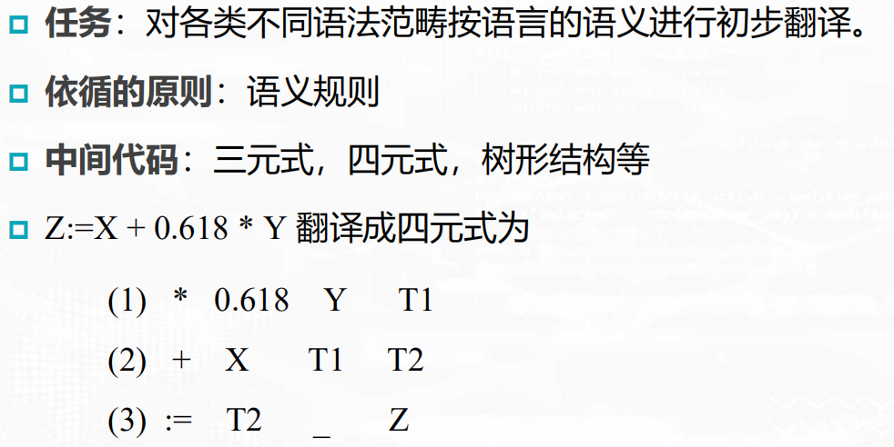
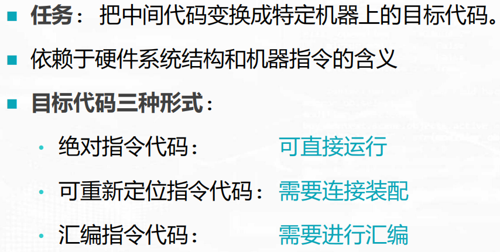
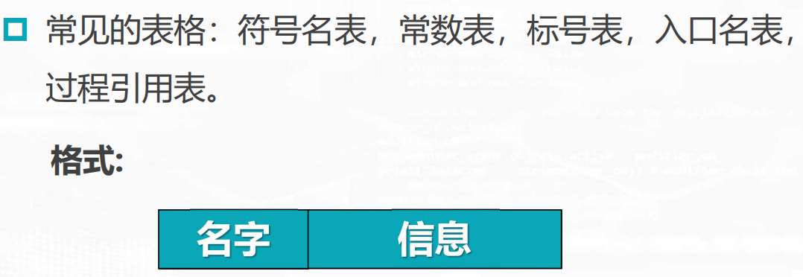

# 编译原理

## 第一章 引论

### 翻译程序

### 编译程序

**分类**:

### 解释程序

### 编译过程

**词法分析**:

**语法分析**:

**中间代码产生**:

**优化**:

**目标代码生成**:

### 编译程序逻辑结构

### 表格与表格管理

### 出错处理

### 遍（Pass)

### 编译前端和后端

### 参数传递

### 存储管理

