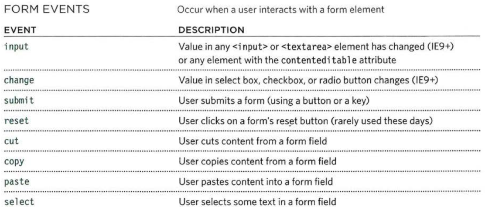

# WEB笔记

## ch01 概述与基础知识

### Web应用工作原理

* 客户端把请求发送到服务器端的Web应用程序，Web应用程序接收请求后进行相关处理，并把客户端请求的资源以文本、图片、网页等形式返回到客户端。
* 由于解析HTML文件一般为浏览器，所以将这种架构称为B/S架构(Browser/Server)。

### Web应用的特点

* 发送到集中部署，无需安装客户端程序。
* 集中管理，业务逻辑在服务段进行维护。
* 数据共享，所有客户端访问同一服务器。
* 更强大的平台无关性，不必关心客户端的软硬件平台。

### HTTP

* URL(Uniform Resource Location)
    1. 语法1：protocol://[host.]domain[:port][/context][/resource][?query=string]

    2. 语法2：protocol://IP address [:port][/context][/resource][?query=string]

* 请求
    1. 方法-URI-协议/版本
    2. 请求头
    3. 请求正文

* 请求类型
    1. GET：获取资源
    2. POST：传输实体文本
    3. PUT：传输文件
    4. DELETE：删除资源或文件
    5. HEAD：获取响应报文头部
    6. OPTIONS：询问支持的方法
    7. TRACE：追踪路径

* 响应
    1. 协议-状态码-描述
    2. 响应头-信息
    3. 响应正文

* 状态码
    |HTTP状态码|含义|
    |:-------:|:--:|
    |200|请求成功|
    |201|请求成功并在服务器上创建新资源|
    |202|请求被接受，但未处理完成|
    |204|请求成功，但未发布任何新内容|
    |404|请求的资源不可用|
    |500|服务器发生内部错误|
    |501|服务器不支持完成请求所需功能
    |503|服务器过载，不能对请求进行服务|

### Web开发平台

* java
* .NET
* php

### XML(eXtensible Markup Language)可扩展标记语言

* XML语法规范
    1. XML规范将一个XML文档分为序言和文档元素两个部分。
    2. 序言部分包含XML声明、注释和文档类型定义等；文档元素部分则包含元素、子元素、属性和文本等。
    3. XML声明：XML声明必须是文档的第一行。

* 根元素
    1. 每个XML文档有且只有一个根元素。
    2. 根元素是一个完全包含文档中其他所有元素的元素。

* 元素
    1. 一个元素由开始标记、结束标记、可选属性和可选文本组成。

* 格式
    1. 必须有声明语句
    2. 有且仅有一个根元素
    3. 大小写敏感、属性值用引号、标记成对、空标记关闭。。。

* 有效的XML文档——格式良好+符合DTD或Scheme

* DTD(文档定义类型)
    1. DTD文档包括：
        >1.元素(ELEMENT)的定义则。
        >2.元素之间的关系规则
        >3.属性(ATTLIST)的定义规则
        >4.可使用的实体(ENTITY)和符号(NOTATION)规则

    2. DTD与XML的关系
        >1.类与对象
        >2.数据库表结构与数据记录

    3. 为什么需要DTD
        >1.不同组织的人可以使用一个通用DTD用来交换数据。
        >2.应用程序可以使用一个标准DTD校验从外部世界接受来的XML数据是否有效。

* DTD缺点
    1. DTD不遵守XML语法，导致写XML文档时用一种语法，写DTD时又用另外一种语法；
    2. DTD数据类型有限，不可扩展，不支持命名空间。

* Schema
    1. Schema基于XML语法，所以可以使用解析XML的工具解析Schema文件；
    2. Schema扩充了数据类型，还支持元素的集成和属性组等。

* JDBC

## ch02 Servlet基础

### Servlet基本概率

* Java Servlet 是运行在 Web 服务器或应用服务器上的程序，它是作为来自 Web 浏览器或其他 HTTP 客户端的请求和 HTTP 服务器上的数据库或应用程序之间的中间层。

### Servlet API

* javax.servlet：定义Servlet和Servlet容器之间契约的类和接口；
* javax.servlet.http: 定义基于HTTP协议的Servlet的类和接口
* javax.servlet.annotation: Servlet、Filter、Listener等接口的注解定义
* javax.servlet.descriptor: 一些配置信息的类型定义。

### javax.servlet包

* Servlet技术的核心是javax.servlet.Servlet接口，所有的Servlet类必须直接或间接的实现Servlet接口。
* Servlet容器负责加载和调和具体的Servlet类，每一个类型的Servlet类只能有一个实例。

### Servlet的生命周期

* 包括加载、实例化、处理客户端请求和销毁。
* 该生命周期有javax.servlet.Servlet接口的init、service、destory方法实现。

## ch03 JSP

### JSP基本概念

1. JSP是什么?

    * JSP：用Servlet来编写Web应用，导致服务端代码过于繁琐和复杂，将Servlet中的静态部分和动态部分分开来编写，同时提供类似HTML的写法，这就是JSP。
    * JSP是一种建立在Servlet规范提供的功能之上的动态网页技术。
    * JSP文件在用户第一次请求时，会被编译成Servlet，然后由这个Servlet处理用户的请求。
    * JSP可以看成是运行时的Servlet。

2. JSP执行

    * 客户端发出请求;
    * JSP容器将JSP转移成Servlet的源代码;
    * 编译Servlet，并加载到内存执行;
    * 将结果响应至客户端。

### JSP语法

1. JSP语法构成

    用途|格式
    :-:|:-:
    静态内容|HTML静态文本
    指令|<%@指令 %>
    表达式|<%=表达式 %>
    小脚本|<% Java代码 %>
    声明|<%! 方法或变量 %>
    标准动作|<jsp:动作名>
    注释|<%-- --%>

2. JSP指令元素

    * **指令(Directives)**:主要用来提供整个JSP网页相关的信息及属性，如编码方式、语法等
    * JSP语法中提供三种指令：
        **page**：设定整个页面的相关信息
        **include**：用于文件的动态包含
        **taglib**：用于使用第三方标签库
    * JSP脚本元素：
        声明：`<%! int i=10; %>`
        表达式：`<%=add(3,4) %>`
        小脚本：

        ```jsp
        <%
            while(i>0) {
                out.println(i);
            }
        %>
        ```

    * JSP标准动作：将使用JSP进行开发过程中常用的代码块（功能）用一个符号来表示，就是标准动作。常用动作有：
        <jsp:include>
        <jsp:forward>
        <jsp:useBean>
        <jsp:setProperty>
        <jsp:getProperty>

    * JavaBean
    * JSP隐式对象：javax.servlet.http包中的接口和对象。
        1. 不需要任何声明和定义就可以直接使用的对象。
        2. JSP2.0规范中提供了9个隐式对象。
            (输入/输出对象)request, response, out;
            (作用域通信对象)session, application, pageContext;
            (Servlet对象)page, config;
            (错误对象)exception

### Web

1. 页面关联

    * Web应用程序的优点之一就是能够聚合大量的信息资源，而单个的Web组件所提供的信息和功能是有限的。因此需要通过Web组件间的关联来实现信息的共享和功能的聚合。
    * Web组件的关联关系：
        1. 请求转发(forward)
            * 请求转发是指将客户端的请求转发给同一个应用程序中的其他Web组件。
            * 在Servlet API中通过RequestDispatcher接口的forward()来实现HTTP请求的转发，同时将ServletRequest和ServletResponse对象传递给目标组件。
            * 在JSP/Servlet技术，具体的操作方式:
                `request.getRequestDispatcher(“目标”).forward();`
                标准动作<jsp:forward />

        2. 请求重定向(redirect)
            * Web组件可以将请求重定向到任意的URL。
            * 重定向后即表明该次请求响应流程已完成：
                返回一个响应给客户端(地址栏发生改变)；
                客户端根据响应发起一次新的请求；
                不能使用之前的request对象。
            * 在JSP/Servlet技术，具体的操作方式有：
                `response.sendRedirect(“目标”);`

        3. 包含(include)

2. 会话跟踪

    * 会话跟踪：维持Web应用中服务端和客户端之间的HTTP连接的方法。
    * Web应用中的常用的会话跟踪方法：
        1. URL重写
        2. 隐藏域
        3. 客户端保存信息(Cookies)
        4. 服务端保存信息(HttpSession)

    * URL重写：URL重写是一种会话跟踪技术，其实现方式是将一个或多个token添加到URL的查询字符串中，每个token以key=value的方式表现。
    * 限制：
        1. URL的长度取决于浏览器限制
        2. URL重写需在服务端完成，token过于复杂难以操作
        3. 某些字符(空格，问号等)必须用base64编码
        4. 所有信息在地址栏均可见

    * 隐藏域：使用隐藏域进行会话跟踪，其原理和重写URL方法类似，区别是将附加在URL中的token信息放置到form表单的隐藏域中。
    * 比较于URL重写方法：
        1. 没有字符数限制
        2. 无须进行特殊编码

    * Cookie：
        1. Cookie是一个对象，其内容主要包含以key-value形式保存的token信息。
        2. Cookie作为HTTP请求头的一部分，其传输由HTTP协议控制。
        3. Cookie可以由服务端构建，也可以由浏览器端的JavaScript语言构建，最终都保存在浏览器中。
        4. Cookie对象除了包含token信息外，还有maxAge、path等属性。
        5. 用Cookies方式来进行会话跟踪的主要缺点是用户可在浏览器进行限制。

    * HttpSession:
        1. HttpSession是所有的会话跟踪技术中最强大和最通用的技术。
        2. 其基本原理是：用户第一次请求服务器时，由服务器创建HttpSession对象，并生成唯一的用户ID(JSESSIONID)，其他会话token信息以key-value的方式保存在HttpSession对象中，将用户ID以Cookie或URL的方式告知客户端浏览器，整个过程由Web容器进行管理和控制。
        3. 服务端程序通过HttpServletRequest对象的getSession()方法获取HttpSession对象，HttpSession提供一系列方法实现上述功能。

## ch04 MVC基础

1. MVC模式


2. MVC分层模型


* **Model**由JavaBean组成，又可以细分为领域对象、业务bean和DAO
* **View**由JSP组成
* **Controller**由Servlet实现

## ch05 EL和JSTL

### EL(Expression Language)表达式语言

* EL是一种简单而强大的语言，提供了在JSP脚本元素范围外使用运行时表达式的功能。
* 主要包括：基于命名空间与嵌套的属性访问、对集合与操作符的访问、映射到Java类中方法的可扩展函数和一组隐式对象。
* 其基本语法为：`${Expression}`
* 提供两个操作符完成取值：.和[]
* 常用场景：表达式求值、访问作用域变量和JavaBean、访问数组与集合。

1. EL运算符
    * []和.运算符：用于对象属性或数组、集合
    * Java支持的算术运算符和逻辑运算符
    * empty运算符
    * EL关键字：and, eq, gt, true, instanceof, or, ne, le, false, empty, not, it, ge, null, div, mod

2. EL隐式对象
    

### JSTL(JSP Standard Tag Library)

* 为了进一步提高代码的可重用性，JSP规范中允许用户自定义标签。
* 一个自定义标签由标签描述文件(.tld)和标签处理程序(.java)两个部分组成。
* SUN公司在JavaEE规范中提供一套较为通用的标签库：标准标签库(JSTL)。
* 在JSP页面使用JSTL需要使用taglib指令
`<%@ taglib uri="http://java.sun.com/jsp/jstl/core" prefix="c" %>`
* 其中uri用于指定tld文件路径，prefix用于给标签指定前缀。
* JSTL结合EL能大量的简化JSP页面的代码。

类型|功能|URI|前缀
:-:|:-:|:-:|:-:
核心标签库|变量控制、逻辑控制、URL管理等|http://java.sun.com/jsp/jstl/core|c
XML|XML内容转换|http://java.sun.com/jsp/jstl/xml|x
国际化|语言控制、格式化等|http://java.sun.com/jsp/jstl/fmt|fmt
数据库|SQL功能|http://java.sun.com/jsp/jstl/sql|sql
函数|集合、字符串操作等|http://java.sun.com/jsp/jstl/functions|fn


## ch06 监听器和过滤器

### 监听器

* Servlet API提供一系列的事件和事件监听接口，在Java Web应用的开发中通过调用这些API可以进行事件驱动的开发
* 监听器接口可以分为三类：
    1. ServletContext：监听Servlet上下文相关事件
    2. HttpSession：监听会话对象Session的相关事件
    3. ServletRequest：监听请求对象Request的相关事件
* 编写监听器方法：
    1. 实现相关监听器接口，并完成具体方法实现

    ```java
    public class XxxListener implements XxxXxxListener {
        //实现事件方法
    }
    ```

    2. 在容器内配置监听器或使用注解

    ```XML
    //web.xml
    <listener>
        <listener-class>Class</listener-class>
    </listener>
    ```

### 过滤器

* Servlet过滤器是JavaEE中的一个小型Web组件。其主要功能是：拦截来自客户端的请求和服务端的响应，进行数据的预处理或其他特定操作。
* 常用场景：
    1. 对用户请求进行统一认证
    2. 对用户访问进行审核和统计
    3. 对用户发送的数据进行过滤或替换
    4. 转换图像格式
    5. 对响应内容进行压缩，减少网络传输量
    6. 对请求或响应数据进行加/解密处理
* 编写过滤器方法：
    1. 实现过滤器接口，并完成具体方法

        ```java
        public class XxxFilter implements Filter {
            init();
            doFilter();
            destroy()
        }
        ```

    2. 在容器内配置过滤器或使用注解

        ```XML
        <filter>
            <filter-name>XxxFilter<filter-name>
            <filter-class>servlet.XxxFilter</filter-class>
        </filter>
        <filter-mapping>
            <filter-name>XxxFilter</filter-name>
            <url-pattern>拦截的URL</url-pattern>
            <dispatcher>拦截的方式</dispatcher>
        </filter-mapping> 
        ```

## ch07 HTML和CSS

## ch08 JavaScript基础

* JavaScript是目前广泛用于客户端开发的一种脚本语言。
* 最初由Netscape公司的Brendan Eich设计，是一种动态、弱类型、基于原型的语言，内置支持类。
* 学习JavaScript语言主要包括三个方面：
    1. JavaScript语言的语法
    2. 内置对象
    3. BOM&DOM模型

* 基本语法
    1. 变量和数据类型
        * JavaScript是弱类型的语言，基本类型变量通过var声明。
        * 变量名命名规范和Java的区别是多一个$字符
        * JavaScript提供三种基本类型：
            1. 数字类型：Java中的整型、浮点型等都属于数字类型
            2. 字符串类型：JavaScript中的字符串类型是基本类型
            3. 布尔类型：true和false
            4. 此外还有null和undefined常量
        * 数组
            1. JavaScript语言中的数组和Java中的数据类似，有两种创建的方式（字面和new关键字），推荐使用字面方式创建数组
            2. JavaScript数组也支持length()和item(index)等方法。
        * 类型转换
            * JavaScript语言是弱类型语言，不会出现类型不一致而赋值或比较错误的问题，会发生默认的类型转换。

    2. 运算符与操作符
        * 严格等于与严格不等于
        

    3. 函数
        * 声明函数通过function关键字
        * 函数没有返回值类型的声明
        * 如果有形参，形参没有类型的声明
        * 特殊用法：
            1. 函数表达式（匿名函数）

                ```js
                var area = function(width, height) {
                    return width * height;
                }

                var size = area(3, 4);
                ```

            2. 立即执行匿名函数

                ```js
                var area = (function() {
                    var width = 3;
                    var height = 2;
                    return width * height;
                })
                ```

    4. 对象
        * 方法一：创建对象然后添加属性和方法
        * 方法二：创建带有属性和方法的对象
        * 使用：
            1. 可以通过.操作符和[]运算符访问对象属性
            2. 属性和方法可以动态增加和删减

    5. 内置对象
        * 浏览器对象模型BOM
        * 文档对象模型
        * 全局JavaScript对象
        
        * window对象（BOM模型）
        
        * document对象（DOM模型）
        
        * 全局对象Stirng
        
        * 全局对象Number
        
        * 全局对象Math
        
        * 全局对象Date和Time
        

## ch09 JavaScript进阶与AJAX基础

### 文档对象模型

* 文档对象模型DOM规定了浏览器应该如何创建HTML元素，以及JavaScript如何操作HTML元素。当浏览器加载Web页面时，会在内存中创建页面的模型——DOM树对象模型。JavaScript语言操作HTML页面内容时，是通过一系列API实现的——DOM API。
* DOM模型
    1. DOM树中每个节点都是对象，拥有方法和属性，可以分为文档节点、元素节点、属性节点和文本节点四大类型。
    2. JavaScript语言可以访问和更新DOM树中的节点对象，针对DOM树的任何修改都会反映在浏览器中。
    3. 操作DOM树一般分为两个步骤：首先定位到需要操作的元素对象节点，然后操作其文本内容、子元素或属性。
* 访问元素
    1. 返回单一元素结点
        `getElementById('id')`
        `querySelector('css selector')`
    2. 返回一个或多个元素结点
        `getElementByClassName('class')`
        `getElementByTagName(‘tag')`
        `querySelectorAll('css selector')`
    3. 遍历(通过元素的下面属性，可以在DOM树中进行遍历)：
        * parentNode
        * previousSibling
        * nextSibling
        * firstChild
        * lastChild
    4. 获取或更新元素内容
        * 文本结点：nodeValue属性
        * 元素结点：
            1. textContent属性
            2. innerText属性
            3. createElement()、createTextNode()、appendChild()和removeChild()方法
            4. innerHTML属性

### 事件

* DOM模型针对浏览器和网页内容规定了一系列的用户相互行为，称为网页事件。
* 事件从类型上可以分为：
    1. 浏览器事件
    2. 键盘事件
    
    3. 鼠标事件
    
    4. 焦点事件
    
    5. 表单事件
    
    6. DOM事件
    
* 事件处理
    1. JavaScript事件处理分为三个步骤：选定元素、事件绑定、事件处理。
    2. 事件绑定有三种方法：HTML绑定、传统DOM绑定和DOM监听器。
        * HTML绑定：
            `<input type="text" onblur="checkUsername()" />`
        * 传统DOM绑定：

            ```js
            var elUsername = document.getElementById('username');
            elUsername.onblur = checkUsername;
            ```

        * 事件监听器方法绑定：
            `elUsername.addEventListener('blur', checkUsername, false);`

            ```js
            elUsername.addEventListener('blur', function() {
                checkUsername(5);
            }, false);
            ```

### AJAX基础

* AJAX: **A**synchronous **J**avaScript **a**nd **X**ML
    1. Asynchronous：异步，指客户端和服务端的通信方式。
    2. JavaScript: 一种客户端脚本语言。(CSS,DOM)
    3. XML: 数据的表示方式。
* AJAX核心概念
    1. 同步通信方式：即典型的请求响应模型。在传统的Web应用模型下，大部分的用户操作都会发送一个HTTP请求给服务器，然后服务器开始处理（接收数据，执行业务逻辑，访问数据库等），最后向浏览器返回HTML页面。
    2. 异步通信方式：异步发送请求，消除了传统的“发送请求－等待－发送请求－等待”的特性，极大的提高了用户体验，其核心是XMLHttpRequest对象。
* 传统Web应用和AJAX应用的区别

* XMLHttpRequest对象
    1. XMLHttpRequest对象是实现AJAX技术的核心技术，是一种支持异步通信的机制。
    2. XMLHttpRequest对象最早是在Microsoft的IE5中以Active X组件形式实现的。
    3. XMLHttpRequest对象不是W3C中的内容，在不同浏览器上的表现有所不同，不过常用的方法和属性都得到了广泛的支持。
    4. XMLHttpRequest对象的常用方法

        |方法|描述|
        |:-:|:-:|
        |abort()|停止当前请求|
        |getAllResponseHeaders()|将响应头作为键值对返回|
        |getResponseHeader(“header”)|返回指定头部字段的值|
        |open(”method”,”url”)|建立对服务器的调用。method参数表示请求方法，url表示请求的资源|
        |send(content)|向服务器发送请求|
        |setRequestHeader()|设置请求头中某个字段的值|

        * void open(**String method, String url**, boolean asynch, String username, String password )
        * 这个方法会建立对服务器的调用。这是初始化一个请求的纯脚本方法。它有两个必要的参数，三个可选的参数。第三个boolean值用于指定是异步还是同步通信方式，默认为true，即异步。

        * void send(content)
        * 这个方法具体向服务器发出请求。如果请求声明为异步的，这个方法就会立即返回，否则它会等待直到接收到响应为止。可选参数可以是DOM对象的实例、输入流，或者串。传入这个方法的内容会作为请求体的一部分发送

    5. XMLHttpRequest对象的常用事件和属性

        |属性和事件|描述|
        |:-:|:-:|
        |onreadystatechange|请求的状态发生改变时会触发这个事件，通常会调用一个JavaScript函数|
        |readyState|表示请求状态的属性，有5个可取的值：0=未初始化，1=正在加载，2=已加载，3=交互中，4=完成。|
        |responseText|服务器的响应，表示为一个字符串|
        |responseXML|服务器的响应，用XML封装，可以被解析为DOM。|
        |status|服务器状态码|

    6. 使用XMLHttpRequest对象完成异步通信的流程
        

## ch10 AJAX进阶与JQuery入门

* 经典的AJAX技术应用场景
    1. 表单验证
    2. 动态加载列表框
    3. 创建自动刷新页面
    4. 显示进度条
    5. 创建工具提示
    6. 自动补全功能
    7. 访问Web服务

### JQuery语法

* jQuery语法是为HTML元素的访问和操作而设计的。
* 基本语法：`$(selector).action()`
    1. $:用于在JavaScript语言中标识jQuery。
    2. selector:选择器，用于查找或查询HTML元素。
    3. action()：指对选择的元素执行的特定操作。
* jQuery选择器
    1. 元素选择器：jQuery使用CSS选择器来选取HTML元素。
        `$("p") //选取<p>元素`
        `$("p.intro") //选取class="intor"的<p>元素`
    2. 属性选择器：jQuery使用Xpath表达式来选取带有给定属性的元素。
        `$("[href]") //选取所有带有href属性的元素`
        `$("[href='*.jpg']") //选取所有href属性以.jpg结尾的元素`
    3. CSS选择器：用于改变HTML元素的CSS属性。
        `$("p").css("background-color", "red") //把所有p元素的背景颜色改为红色`
* 文档就绪函数：为了防止HTML文档在完全加载之前运行jQuery代码，一般会将所有的jQuery调用放到文档就绪函数中。

    ```js
    $(document).ready(function() {
        //jQuery调用
        //jQuery调用
    })
    ```

* 获取元素内容
    1. .html()：获取元素的所有内容包括元素
    2. .text()：获取元素的文本内容
* 插入元素
    1. .before()
    2. .after()
    3. .prepand()
    4. append()
    
* 迭代元素.each()
* 事件处理.on()

## ch11 AJAX、JQuery与JSON

### JSON(JavaScript Object Notation)

* JSON是一种轻量级的数据交换格式，易于人阅读和编写，同时也易于机器解析和生成。
* JSON是JavaScript Programming Language, Standard ECMA-262 3rd Edition - December 1999标准的一个子集。
* JSON采用完全独立于语言的文本格式，但是也使用了类似于C语言家族的习惯(包括C, C++, C#, Java, JavaScript, Perl, Python等)。 这使得JSON成为理想的数据交换语言。
* JSON语法——对象
    1. 对象是一个无序的“键/值”对的集合。
    2. 一个对象以“{”开始，“}”结束。
    3. 每个“键”后跟一个“:”
    4. “键/值”对之间使用“,”（逗号）分隔。
* JSON语法——数组
    1. 数组是值（value）的有序集合。
    2. 一个数组以“[”开始，“]”结束。
    3. 值之间使用“,”（逗号）分隔。
* JSON语法——值：值（value）可以是双引号括起来的字符串string、数值number、true、false、 null、对象object或者数组array。

### JavaScript错误处理

* Error对象
    1. Error对象是JavaScript语言中的异常对象，当脚本中有错误发生时，浏览器会将相关错误信息封装在Error对象中。
    2. 属性：

        |属性|描述|
        |:-:|:-:|
        |name|异常描述|
        |message|描述|
        |fileNumber|JavaScript文件名称|
        |liineNumber|错误所在代码行数|

    3. Error对象继承体系

        |对象|描述|
        |:-:|:-:|
        |Error|一般性错误，父类|
        |SyntaxError|语法错误|
        |ReferenceError|尝试应用未在作用域内声明的量|
        |TypeError|意外的数据类型，无法进行自动类型转换|
        |RangeError|数字超出可接受范围|
        |URIError|URI编码或解码错误|
        |EvalError|eval()函数出错|

* JavaScript错误调试
    1. 工具：Chrome或Firefox的开发者模式，及一些插件。
    2. 使用控制台对象console。
        * console.log()
        * console.info(), warn(), error()
        * console.table()
    3. 断点调试和debugger模式。
    4. 异常处理
        * try-catch-finally
        * throw
